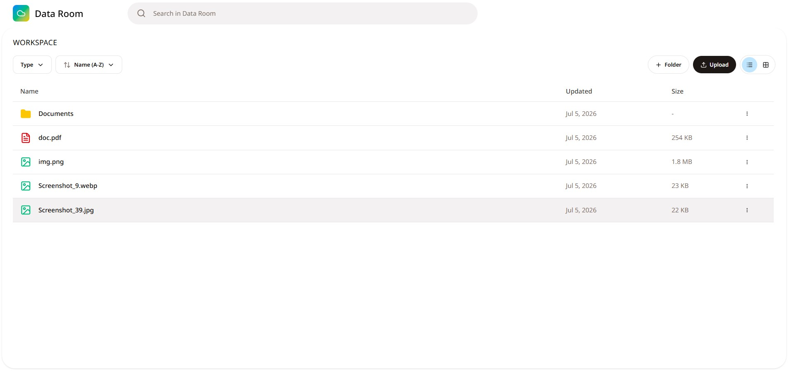

[🇬🇧 English](./README.md) | 🇺🇦 Українська

# Data Room MVP

Віртуальна кімната даних (Data Room) для безпечного зберігання та організації документів. Проєкт реалізовано як SPA у межах тестового завдання.



---

## Швидкий старт

```bash
pnpm install
pnpm dev
```

Застосунок відкриється за адресою [http://localhost:5173](http://localhost:5173).

### Інші команди

| Команда | Опис |
|----------|------|
| `pnpm build` | Збірка production-бандла |
| `pnpm preview` | Попередній перегляд production-збірки |
| `pnpm lint` | Перевірка ESLint |
| `pnpm format` | Форматування коду за допомогою Prettier |

---

## Стек технологій

| Рівень | Технологія |
|--------|------------|
| Фреймворк | React 19 + TypeScript + Vite |
| Стилізація | Tailwind CSS v4 |
| UI-компоненти | shadcn/ui (Radix UI, пресет Sera) |
| Іконки | Lucide React |
| Глобальний стан | Zustand із `persist` middleware |
| Сховище метаданих | IndexedDB через `idb-keyval` |
| Сховище файлів | IndexedDB через `idb` |
| Сповіщення | Sonner |
| Шрифти | Noto Sans, Playfair Display (змінні шрифти) |

---

## Архітектура та ключові рішення

### Чому IndexedDB, а не справжній бекенд

Завдання допускає використання мок-сховища. IndexedDB було обрано замість `localStorage` або `sessionStorage` з кількох причин:

1. **Немає обмеження в 5 МБ.** `localStorage` не підходить для зберігання бінарних даних. IndexedDB дозволяє зберігати `Blob`-об'єкти безпосередньо, а браузер сам керує доступною квотою.
2. **Асинхронний API.** Операції з IndexedDB не блокують основний потік, на відміну від синхронного `localStorage`.
3. **Розділення метаданих і бінарних даних.** Метадані вузлів (назва, розмір, тип, дата) зберігаються через `idb-keyval` і серіалізуються у JSON. Самі `Blob`-об'єкти зберігаються через `idb` за унікальним `blobId`. Zustand ніколи не містить бінарних даних — лише посилання на ключ в IndexedDB. Це запобігає зависанню інтерфейсу під час рендерингу.
4. **Персистентність між сесіями.** Дані зберігаються після перезавантаження сторінки без необхідності розгортати серверну інфраструктуру.

### Нормалізована плоска структура даних

Усі папки та файли зберігаються в єдиному `Record<string, DataRoomNode>` у Zustand. Зв'язок між вузлами реалізовано через поле `parentId: string | null` (корінь — `null`). Такий підхід:

- спрощує каскадне видалення (`getDescendantIds` — ітеративний обхід графа);
- не потребує глибокого клонування вкладених дерев під час оновлення;
- добре масштабується при додаванні пошуку або фільтрації по всьому дереву.

### Розділення відповідальності

```text
store/dataRoomStore.ts   → метадані вузлів і UI-стан (сортування, вигляд, фільтр)
store/conflictStore.ts   → черга діалогів конфлікту імен (не персистується)
db/blobStore.ts          → єдина точка доступу до IndexedDB (idb)
lib/*Helpers.ts          → чиста бізнес-логіка, незалежна від React
```

Компоненти викликають хелпери з `lib/` і не містять бізнес-логіки безпосередньо.

### Синхронізація URL

`useUrlSync` синхронізує навігацію та налаштування інтерфейсу з query-параметрами:

```text
?folder=<id>&sort=name-asc&view=grid&filter=all&folders=top
```

Підтримується навігація за допомогою кнопок **«Назад» / «Вперед»** браузера (`popstate`). Зміна папки додає новий запис до історії (`pushState`), тоді як зміна параметрів відображення або сортування замінює поточний запис (`replaceState`).

### Збирач сміття

Під час кожної гідратації сховища запускається `runGarbageCollector`: він порівнює `blobId` із метаданих із реальними ключами в IndexedDB та видаляє «осиротілі» Blob-об'єкти. Це запобігає накопиченню недосяжних файлів, наприклад, якщо вкладку було закрито під час часткового видалення.

---

## Завантаження файлів

### Підтримувані формати

Застосунок підтримує **PDF-файли** та **зображення** (webp, png, jpg/jpeg, tiff).

### Перевірка сигнатури файлів

Застосунок перевіряє не лише MIME-тип, а й **магічні байти** кожного завантажуваного файлу, щоб запобігти завантаженню пошкоджених чи підроблених файлів (наприклад, файлів з вручну зміненим розширенням):

- **PDF**: Перевіряє сигнатуру (`%PDF-`, hex `25 50 44 46 2D`) на початку та маркер `%%EOF` наприкінці файлу.
- **Зображення**: Перевіряє офіційні магічні байти підтримуваных форматів (PNG, JPEG, WebP, TIFF) на початку файлу.

### Обмеження розміру

Максимальний розмір одного файлу — **3 МБ**. Це обмеження введено для дотримання квот браузерного сховища. Якщо файл перевищує ліміт, відображається toast-повідомлення про помилку, а інші файли з мультивибору продовжують завантажуватися.

### Завантаження кількох файлів

Файли обробляються незалежно один від одного. Помилка одного файлу (неправильний формат, перевищення розміру або збій запису в IndexedDB) не перериває завантаження інших. Для кожного файлу відображається окреме toast-повідомлення про результат.

---

## Обробка помилок

### Error Boundary

Застосунок обгорнуто в `ErrorBoundary` (`src/components/layout/ErrorBoundary.tsx`). У разі виникнення необробленого винятку в дереві компонентів користувач бачить екран помилки з кнопкою **«Перезавантажити сторінку»** замість білого екрана. Це особливо актуально при помилках гідратації IndexedDB або пошкодженні даних у сховищі.

### Обробка конфліктів імен

Під час завантаження файлу з назвою, яка вже існує в поточній папці, відображається діалог із трьома варіантами:

- **Перезаписати** — замінює вміст існуючого файлу; старий `Blob` видаляється з IndexedDB.
- **Зберегти обидва** — створює копію з автоматичним суфіксом: `report (1).pdf`.
- **Скасувати** — пропускає цей файл.

Діалоги ставляться в чергу через `conflictStore`: кожен повертає `Promise<ConflictDecision>`, який виконується лише після вибору користувача.

### Квота браузерного сховища

Окремий файл обмежений **3 МБ**, але браузер також накладає **загальну квоту IndexedDB** на origin. Завантаження багатьох файлів близько до ліміту може спричинити `QuotaExceededError` при наступному записі — не обов'язково на файлі, що перевищує 3 МБ.

Перед кожним завантаженням `canStoreBytes()` у `lib/storageHelpers.ts` викликає `navigator.storage.estimate()` і резервує **512 КБ** під метадані. Якщо місця недостатньо, завантаження блокується зі зрозумілим toast-повідомленням. Якщо IndexedDB все одно кидає `QuotaExceededError` під час `saveBlob`, помилка перехоплюється і показується явно, а не як загальний збій.

### Приватний / інкогніто режим

Деякі браузери (особливо Safari) сильно обмежують або блокують персистентність IndexedDB в приватному режимі. Під час старту `useStorageInit` запускає `checkStorageAvailability()`:

1. Тестує запис/читання в `idb-keyval` (метадані).
2. Тестує blob-сховище через `testBlobDbAccess()`.
3. Перевіряє `navigator.storage.persisted()` — `false` означає ефемерне сховище.

Якщо IndexedDB повністю недоступний, застосунок **переходить у сесійний режим**: метадані та blob-и зберігаються в пам'яті (`configureMetadataStorage`, `setBlobStorageBackend`) без падіння. В приватному режимі **`StorageWarningBanner`** і toast пояснюють, що дані доступні лише в поточній сесії і можуть бути очищені після закриття вікна.

### Дві відкриті вкладки одночасно

Якщо застосунок відкритий у двох вкладках, обидві незалежно пишуть у IndexedDB, а Zustand у кожній вкладці «знає» лише про власні зміни — класичний race condition (наприклад, файл, видалений в одній вкладці, у другій залишається «живим» до перезавантаження).

`useTabSync` вирішує це через **`BroadcastChannel`**: при зміні метаданих в одній вкладці інші перечитують стан через `rehydrateFromStorage()`. Синхронізація також відбувається при поверненні фокусу на вкладку (`visibilitychange`). Якщо дані реально змінилися, користувач бачить toast: *«Data was updated in another tab»*. Broadcast дебаунситься (200 мс), щоб persist-запис у `idb-keyval` встиг завершитися до читання в інших вкладках.

---

## Функціональність

### Папки

- ✅ Створення з валідацією назви (порожній рядок, лише пробіли, понад 255 символів)
- ✅ Необмежена вкладеність
- ✅ Перейменування з автоматичним вирішенням дублікатів
- ✅ Видалення з каскадним видаленням усіх вкладених вузлів і toast-звітом про кількість видалених елементів

### Файли

- ✅ Завантаження через drag-and-drop або вибір файлів
- ✅ Перегляд файлів безпосередньо в браузері (PDF через `<iframe>`, зображення через ``)
- ✅ Перейменування (зі збереженням розширення)
- ✅ Завантаження через `URL.createObjectURL`
- ✅ Видалення з очищенням `Blob` в IndexedDB

### UI

- ✅ Два режими відображення: сітка / список
- ✅ Сортування: за назвою, датою оновлення, розміром (↑/↓)
- ✅ Фільтр за типом: усі / папки / файли / зображення
- ✅ Розташування папок: зверху / разом із файлами
- ✅ Клікабельні хлібні крихти
- ✅ Контекстне меню за правою кнопкою миші
- ✅ Стан порожньої папки (`EmptyState`)
- ✅ Toast-повідомлення після кожної дії
- ✅ Довгі назви з `text-overflow: ellipsis` і tooltip
- ✅ Синхронізація стану з URL
- ✅ Адаптивна верстка — інтерфейс працює на мобільних, планшетах і десктопах

---

## Структура проєкту

## Project Structure

```text
src/
  components/
    data-room/    # контейнер, тулбар, хлібні крихти, порожній стан
    file/         # завантаження, drop-зона, перегляд PDF
    folder/       # діалог створення папки
    node/         # картка, контекстне меню, діалоги перейменування та видалення
    layout/       # AppShell, ErrorBoundary, StorageWarningBanner

  store/
    dataRoomStore.ts   # метадані + UI-стан (Zustand + idb-keyval)
    conflictStore.ts   # черга діалогів конфлікту імен

  db/
    blobStore.ts       # єдина точка доступу до Blob/IndexedDB

  hooks/
    useCurrentFolder.ts
    useFileUpload.ts
    useUrlSync.ts
    useDebounce.ts
    useMediaQuery.ts

  lib/
    nodeHelpers.ts     # getChildren, getDescendantIds, isPdf, isImage, isSupportedFile
    nameHelpers.ts     # validateName, resolveDuplicateName, splitExtension
    sortHelpers.ts     # sortNodes
    formatHelpers.ts   # formatFileSize, formatDate
    downloadHelper.ts  # downloadNode
    storageHelpers.ts  # оцінка квоти, детекція інкогніто, QuotaExceededError

  types/
    dataRoom.ts        # загальні типи
```

### Чому не FSD / feature-based архітектура

Feature-Sliced Design (або будь-яка feature-based архітектура) додав би значний структурний оверхед — шари `entities/`, `features/`, `widgets/`, `shared/` — який не окупається для проєкту такого розміру.

Обрана структура групує код за **технічною роллю** (`components/`, `hooks/`, `lib/`, `store/`, `db/`), а не за фічерами. З єдиною доменною областю (файли і папки) та невеликою кодовою базою це робить навігацію простою і уникає передчасної абстракції.

---

## Модель даних

Плоске нормалізоване сховище. Зв'язок між вузлами здійснюється через `parentId`.

```ts
interface BaseNode {
  id: string
  name: string
  normalizedName: string   // нижній регістр + trim для порівняння без урахування регістру
  parentId: string | null  // null = корінь
  type: "folder" | "file"
  createdAt: number
  updatedAt: number
}

interface FileNode extends BaseNode {
  type: "file"
  mimeType: string
  size: number
  extension: string  // наприклад "pdf"
  blobId: string     // ключ в IndexedDB; сам Blob не зберігається в Zustand
}
```

---

## Опрацьовані граничні випадки

| Ситуація | Поведінка |
|----------|-----------|
| Дубльована назва під час створення або завантаження | Автоматичний суфікс `name (1).pdf` |
| Завантаження не-PDF і не-зображення | Toast-повідомлення про помилку, файл пропускається |
| Файл із підробленим розширенням | Перевірка магічного байта (`%PDF`) та маркера кінця файлу (`%%EOF`), файл відхиляється |
| Файл понад 3 МБ | Toast-повідомлення про помилку, файл пропускається |
| Файл 0 байт | Перехоплюється `isEmptyFile()` до будь-яких інших перевірок; toast-повідомлення про помилку |
| «Зіпсований» PDF із валідною сигнатурою | Перевіряється заголовок `%PDF` і хвіст `%%EOF`; якщо вміст обрізаний — браузерний iframe показує помилку рендерингу |
| Видалення папки з вкладеними вузлами | Діалог із точною кількістю елементів, каскадне видалення |
| Порожня назва або лише пробіли | Валідація, кнопка підтвердження неактивна |
| Назва довша за 255 символів | Помилка валідації |
| Перейменування в уже існуючу назву | Автоматичний суфікс |
| Перейменування лише за регістром (`Report` → `report`) | Поточний вузол виключається з перевірки дублів через `ignoreNodeId`; перейменування виконується без хибного конфлікту |
| Юнікод / емодзі / RTL у назвах | Нормалізація `NFKC` + `toLocaleLowerCase(navigator.language)` для порівняння; `localeCompare` з `sensitivity: "base"` для сортування |
| Два файли з однаковою назвою в одному batch-завантаженні | Кожен файл перевіряється відносно Set `batchNormalizedNames` додатково до існуючих вузлів у папці; діалог конфлікту показується до запису будь-якого з файлів |
| Неіснуючий `folderId` у URL після перезавантаження | Скидання до кореня |
| Навігація «Назад/Вперед» на видалену папку | Обробник `popstate` перечитує URL; ID видаленої папки не проходить перевірку `node.type === "folder"` і відбувається скидання до кореня |
| Помилка одного файлу під час мультизавантаження | Інші файли продовжують завантажуватися |
| Закриття вкладки під час завантаження | Збирач сміття видалить осиротілі Blob-об'єкти під час наступного запуску |
| Загальна квота браузерного сховища майже вичерпана | Перед завантаженням перевіряється `navigator.storage.estimate()`; зрозумілий toast при нестачі місця; `QuotaExceededError` обробляється явно |
| Приватний / інкогніто режим | Перевірка сховища при старті; банер-попередження + toast; fallback у in-memory сесійний режим, якщо IndexedDB заблоковано |
| Дві вкладки відкриті одночасно | `BroadcastChannel` синхронізує метадані між вкладками; rehydrate при фокусі; toast, якщо дані змінилися в іншій вкладці |
| Активний фільтр не дає результатів | Показується окремий стан `empty-filter` замість `empty-folder`; текст пояснює, що причина — фільтр |